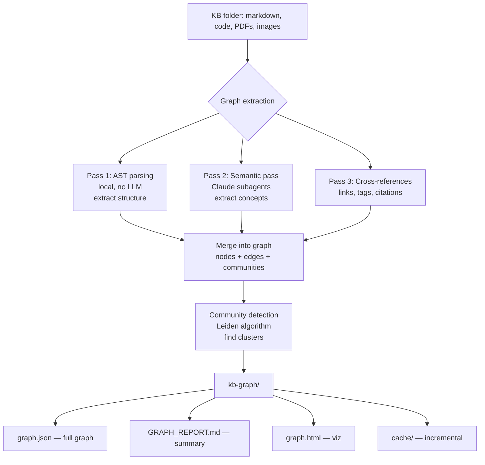

# Knowledge Graph for KB Search in Axonize

> Inspired by [Graphify](https://github.com/safishamsi/graphify) — build a queryable knowledge graph over Axonize's knowledge base for structure-first agent search

---

## The Problem: Blind Search vs. Structure-Aware Navigation

### Current State
When agents need to find information in a knowledge base, they typically:
1. **Grep through files** — search for keywords, read many files to find the right one
2. **Open many files** — each file costs tokens, time, and context window space
3. **Miss connections** — can't see relationships between concepts across files
4. **Repeat searches** — no memory of what's where, must rediscover structure each session

**Example inefficiency:**
```
Agent: "Find the payment retry logic"
→ Greps 40 files for "payment" and "retry"
→ Opens 8 candidate files (high token cost)
→ Reads through each to find the actual retry wrapper
→ 3-4 round-trips, thousands of tokens
```

### With a Knowledge Graph
```
Agent: "Find the payment retry logic"
→ Reads graph report: payment/ community has god node `processPayment`
→ Opens that one file, finds retry wrapper immediately
→ 1 round-trip, 100x fewer tokens
```

---

## Vision: Knowledge Graph Islands in Axonize

### What is a Knowledge Graph Island?

A **knowledge graph island** is a special island type (per the [focused-islands-vision](../focused-islands-vision.md)) that represents the structure of your knowledge base:

- **Nodes** = concepts, topics, files, sections, functions, ideas
- **Edges** = relationships, references, similarities, hierarchies
- **Communities** = clusters of related concepts discovered by graph algorithms
- **Confidence tags** = how certain we are about each relationship

### The Graphify Approach

From [Graphify's architecture](https://github.com/safishamsi/graphify):



**Key insight:** Graph topology IS the similarity signal. No embeddings, no vector DB needed.

---

## Architecture for Axonize

### 1. Graph Extraction Pipeline

#### Input: Axonize Knowledge Base
```
kb/
├── concepts/
│   ├── machine-learning.md
│   ├── neural-networks.md
│   └── transformers.md
├── projects/
│   ├── project-alpha.md
│   └── project-beta.md
├── code/
│   ├── auth.py
│   └── payments.py
└── research/
    ├── paper-summaries.md
    └── architecture-decisions.md
```

#### Pass 1: Structural Extraction (Local, 0 tokens)

**For Markdown files:**
- Headings → nodes (with hierarchy)
- Internal links `[[concept]]` → edges
- Tags `#topic` → nodes + edges
- Code blocks → special nodes
- Lists → nodes (if substantial)

**For Code files (if applicable):**
- Tree-sitter AST parsing
- Functions/classes → nodes
- Imports/calls → edges
- Docstrings → concept extraction

**For Images:**
- Image → multimodal vision pass (Pass 2)
- Captions/alt-text → concept nodes

#### Pass 2: Semantic Extraction (LLM)

Run Claude subagents in parallel over each file:

```python
# Prompt template for semantic extraction
"""
Read this knowledge base file and extract:

1. **Core concepts** — 3-5 main ideas/topics discussed
2. **Relationships** — how these concepts relate to each other
3. **Connections** — likely related files/topics (based on content)
4. **Confidence** — for each relationship, rate 0.0-1.0

Return JSON:
{
  "concepts": ["concept_a", "concept_b"],
  "relationships": [
    {"from": "concept_a", "to": "concept_b", "type": "requires", "confidence": 0.9}
  ],
  "likely_related": ["file_x", "topic_y"]
}
"""
```

**Optimization:** Batch process changed files only (SHA256 cache like Graphify)

#### Pass 3: Cross-Reference Resolution

- Resolve fuzzy references ("see ML section" → link to `machine-learning.md`)
- Find implicit connections (co-occurrence of tags, similar language)
- Weight edges by evidence strength (explicit link = 1.0, inferred = 0.6)

#### Graph Construction

Build a NetworkX graph:

```python
import networkx as nx

G = nx.DiGraph()

# Nodes
G.add_node("transformers.md", type="file", concepts=["attention", "NLP"])
G.add_node("attention", type="concept", files=["transformers.md"])

# Edges
G.add_edge("transformers.md", "attention",
           type="discusses", confidence=1.0, provenance="EXTRACTED")
G.add_edge("attention", "neural-networks.md",
           type="used_in", confidence=0.85, provenance="INFERRED")
```

#### Community Detection

Use **Leiden algorithm** (via graspologic) to find clusters:

```python
from graspologic.partition import hierarchical_leiden

communities = hierarchical_leiden(G)
# Result: {
#   "ml_core": ["neural-networks.md", "transformers.md", "attention"],
#   "auth_system": ["auth.py", "users.md", "jwt"],
#   "project_alpha": ["project-alpha.md", "design-doc.md"]
# }
```

**Why Leiden?**
- No embeddings needed (uses graph structure)
- Fast (scales to 100k+ nodes)
- Hierarchical (finds clusters at multiple scales)

### 2. Graph Output Artifacts

#### Output Structure
```
kb-graph/
├── graph.json           # Full graph (nodes, edges, communities)
├── GRAPH_REPORT.md      # 1-page summary for agents
├── graph.html           # Interactive visualization
└── cache/               # SHA256-keyed incremental cache
    ├── file1.md.json
    └── file2.md.json
```

#### `graph.json` Schema

```json
{
  "nodes": [
    {
      "id": "transformers.md",
      "type": "file",
      "title": "Transformer Architecture",
      "path": "concepts/transformers.md",
      "concepts": ["attention", "NLP", "sequence-to-sequence"],
      "degree": 12,
      "community": "ml_core"
    },
    {
      "id": "attention",
      "type": "concept",
      "discussed_in": ["transformers.md", "neural-networks.md"],
      "degree": 8,
      "community": "ml_core"
    }
  ],
  "edges": [
    {
      "from": "transformers.md",
      "to": "attention",
      "type": "discusses",
      "confidence": 1.0,
      "provenance": "EXTRACTED"
    },
    {
      "from": "attention",
      "to": "neural-networks.md",
      "type": "related",
      "confidence": 0.85,
      "provenance": "INFERRED"
    }
  ],
  "communities": {
    "ml_core": {
      "name": "Machine Learning Core Concepts",
      "nodes": ["transformers.md", "neural-networks.md", "attention"],
      "god_nodes": ["neural-networks.md", "attention"],
      "description": "Foundational ML concepts and architectures"
    }
  }
}
```

#### `GRAPH_REPORT.md` Template

This is what agents read first:

```markdown
# KB Graph Report

**Generated:** 2026-05-21
**Files indexed:** 127
**Concepts extracted:** 342
**Communities found:** 8

---

## Communities Overview

### 1. Machine Learning Core (23 nodes)
**God nodes:** neural-networks.md (degree: 18), attention (degree: 12)

Key concepts: transformers, backpropagation, gradient descent, attention mechanism

**Surprising connections:**
- transformers.md → project-alpha.md (uses transformer for text analysis)
- attention → ui-patterns.md (UI attention vs ML attention - semantic collision)

### 2. Authentication & Security (15 nodes)
**God nodes:** auth.py (degree: 11), jwt (degree: 8)

Key concepts: JWT, OAuth, password hashing, session management

**Surprising connections:**
- auth.py → payments.py (payment endpoints require auth middleware)

### 3. Project Alpha (12 nodes)
**God nodes:** project-alpha.md (degree: 9), design-doc.md (degree: 7)

---

## Query Patterns

**To find payment logic:** Start with `payments.py` (community: backend_services)
**To understand ML:** Start with `neural-networks.md` → `transformers.md`
**For auth questions:** Start with `auth.py` or search jwt concept
```

### 3. Agent Integration

#### PreSearch Hook

When an agent is about to search the KB, inject graph context:

```python
# In Axonize agent loop
@before_tool_use("search_kb")
def inject_graph_context(query: str) -> str:
    """Read graph before blind search"""

    if graph_exists():
        graph_summary = read_file("kb-graph/GRAPH_REPORT.md")

        return f"""
Knowledge graph available. Before searching files:

1. Check if {query} matches any god nodes or communities
2. Start with highest-degree nodes first
3. Use graph relationships to navigate

{graph_summary}

Now proceed with your search strategy.
"""

    return query  # No graph, proceed normally
```

#### Query Strategies

**Strategy 1: Concept-first search**
```
Agent query: "How does authentication work?"
→ Graph lookup: "authentication" or "auth" concept
→ Find community: "Authentication & Security"
→ God node: auth.py (degree 11)
→ Open auth.py first (high confidence)
```

**Strategy 2: File-to-related**
```
Agent: "What uses the transformer model?"
→ Find node: transformers.md
→ Traverse incoming edges with type="uses" or "references"
→ Result: [project-alpha.md, nlp-pipeline.py, research/paper-summaries.md]
→ Open those files
```

**Strategy 3: Community exploration**
```
Agent: "What's in the ML section?"
→ Find community: "Machine Learning Core"
→ List all nodes in community
→ Present structure: "23 files, main entry points: neural-networks.md, transformers.md"
```

### 4. Graph Island in Focused-Islands

#### Read Mode (In-Flow)

Show a **minimap** of the graph community relevant to the current file:

```markdown
# Transformer Architecture

[Graph Minimap: ML Core community - 5 related concepts]

Content of the file...
```

**Minimap rendering:**
```
   transformers.md (you are here)
   ├─ attention (discusses)
   ├─ neural-networks.md (extends)
   └─ project-alpha.md (uses)
```

#### Focus Mode (Panel Takeover)

Double-click the minimap → full interactive graph view:

**Left panel:** Graph visualization (D3.js force-directed layout)
**Right panel:** Selected node details + AI suggestions

**Interactions:**
- Click node → highlight connections, show file preview
- Drag to explore neighborhoods
- Filter by edge type, confidence, community
- Search for concepts/files

**Agent suggestions in focus mode:**
- "Explore the ML Core community"
- "Find all files that use attention"
- "Show surprise connections across communities"
- "Explain why these two nodes are connected"
- "Add a new concept node linking these files"

#### Applying the Decision Rubric

From [focused-islands-vision.md](../focused-islands-vision.md#decision-rubric-for-new-island-types):

1. ✅ **Markdown representation:** Graph minimap as custom HTML island or mermaid diagram
2. ✅ **Read-mode rendering:** Simple node list or minimap (cheap, static)
3. ✅ **Round-trip:** Graph stored in `kb-graph/graph.json`, minimap derives from it
4. ✅ **Focus mode value:** Interactive exploration, AI-guided navigation, concept queries
5. ✅ **Agent suggestions:**
   - "Find all files about [topic]"
   - "Explain the connection between X and Y"
   - "What are the main topics in this community?"
   - "Show me the most central concepts"
   - "Add [new-file.md] to the graph"

**Conclusion:** Knowledge graph qualifies as a new island type.

---

## Implementation Plan

### Phase 1: Graph Extraction MVP
**Goal:** Build the graph, no UI yet

- [ ] File scanner (walks KB directory)
- [ ] Pass 1: Structural extractor (markdown headings, links, tags)
- [ ] Pass 2: Semantic extractor (Claude subagents in parallel)
- [ ] Graph builder (NetworkX)
- [ ] Community detection (Leiden via graspologic)
- [ ] Output: `graph.json` + `GRAPH_REPORT.md`
- [ ] Incremental cache (SHA256, only re-extract changed files)

**Success metric:** Generate graph for 100+ file KB in < 2 minutes (excluding LLM calls)

### Phase 2: Agent Integration
**Goal:** Agents use graph before searching

- [ ] PreSearch hook injection
- [ ] Graph query DSL (simple: "find concept X", "list community Y")
- [ ] Agent prompt templates (with graph context)
- [ ] CLI command: `ax kb graph build` / `ax kb graph query "transformers"`

**Success metric:** Reduce file reads by 5x for common queries (measured via agent logs)

### Phase 2b: Agent Lexical Search Index
**Goal:** Give agents fast exact and ranked lexical search over large vaults without moving vector search yet

- [ ] Add `.axonize/search/search.db` as a local SQLite-backed search store
- [ ] Create a shared `segments` table for file path, line/block range, text, content hash, and optional heading metadata
- [ ] Add a trigram FTS index for grep-like substring lookup over large corpora
- [ ] Add a BM25 FTS index for ranked lexical search over the same segment metadata
- [ ] Keep vector embeddings in the current RAG storage path for now; link search results to RAG chunks/segments by stable IDs where possible
- [ ] Build one incremental indexer that reuses file hashing and exclusion rules from the existing RAG indexer
- [ ] Expose agent MCP tools:
  - `indexed_grep` for exact substring search, simple regex candidate narrowing, and fallback guidance for complex regex
  - `bm25_search` for ranked keyword-style retrieval
  - `search_status` for freshness/index availability
- [ ] Update the agent prompt to prefer `indexed_grep` for exact vault-wide lookup, `bm25_search` for lexical relevance, `rag_query` for semantic questions, and built-in Grep only as fallback
- [ ] Add tests for incremental updates, deleted files, substring hits, case sensitivity, path filters, result limits, and stale-index behavior

**Success metric:** Agent exact-search tasks over large vaults avoid broad filesystem Grep and return cited line snippets with stable latency.

### Phase 3: Graph Island UI (Read Mode)
**Goal:** Show graph context in documents

- [ ] Minimap renderer (markdown → graph minimap)
- [ ] Display related nodes for current file
- [ ] Hover to see edge details
- [ ] Click to navigate to related file

**Success metric:** Users can discover related concepts without leaving the file

### Phase 4: Graph Island UI (Focus Mode)
**Goal:** Interactive graph exploration

- [ ] D3.js force-directed graph viz
- [ ] Node selection → file preview
- [ ] Filter by community, edge type, confidence
- [ ] Search bar for concepts/files
- [ ] AI suggestions panel ("Explore X", "Find Y")

**Success metric:** Users spend 30%+ less time searching, 50%+ more time reading

### Phase 5: Graph Maintenance
**Goal:** Keep graph fresh as KB evolves

- [ ] Auto-rebuild on file save (debounced)
- [ ] Git hooks (post-commit, post-checkout)
- [ ] Diff viewer (show graph changes between commits)
- [ ] Manual edit UI (add/remove edges, adjust confidence)

**Success metric:** Graph stays <1min out of date during active editing

---

## Technical Considerations

### Graph Storage: Why JSON?

- **Human-readable:** Easy to inspect, debug, commit to git
- **Portable:** No database setup, works on any machine
- **Diffable:** Git shows graph changes as JSON diffs
- **Fast:** For <10k nodes, JSON parsing is instant

**Alternative (future):** SQLite for >10k nodes, but start with JSON.

### Edge Confidence Rubric

| Confidence | Provenance | Example |
|------------|------------|---------|
| 1.0 | EXTRACTED | Explicit markdown link `[[target]]` |
| 0.9 | EXTRACTED | Tag co-occurrence in same file |
| 0.8 | EXTRACTED | Heading hierarchy (parent/child) |
| 0.7 | INFERRED | LLM says "strongly related" |
| 0.5 | INFERRED | LLM says "somewhat related" |
| 0.3 | AMBIGUOUS | Weak keyword overlap |

**Filtering:** Agents default to confidence ≥ 0.7 for suggestions.

### Performance: 100-File KB Benchmark

**Target:** Build graph for 100 markdown files in < 2 minutes

**Bottleneck:** LLM semantic extraction (Pass 2)

**Optimization:**
1. **Parallel subagents:** Process 10 files concurrently (batching API calls)
2. **Incremental cache:** Only re-extract changed files (SHA256 checksums)
3. **Smart sampling:** For very large files, extract concepts from headings + first/last paragraphs only

**Expected cost:**
- 100 files × 500 tokens/file = 50k input tokens
- 100 files × 200 tokens output = 20k output tokens
- ~$0.50 per full rebuild (Claude Haiku), ~$0.05 for incremental

### Privacy & Local-First

Following Graphify's philosophy:

- **No telemetry:** Graph extraction runs locally
- **No cloud storage:** Graph lives in project directory
- **LLM optional:** Pass 1 (structural) works without LLM
- **Opt-in semantic:** User must enable Pass 2 (LLM extraction)

---

## Advanced Features (Future)

### 1. Temporal Graph (Git History)

Track how the graph evolves over time:

```bash
ax kb graph timeline --from 2024-01-01 --to 2024-12-31

# Output: Video/animation of graph growth
# - New concepts appear as nodes spawn
# - Connections strengthen as cross-references increase
# - Communities shift as project focus changes
```

**Use case:** Understand how knowledge base evolved, which topics are growing/shrinking.

### 2. Cross-KB Graphs

Link multiple knowledge bases:

```
repos/
├── axonize-kb/
│   └── kb-graph/
├── personal-notes/
│   └── kb-graph/
└── team-wiki/
    └── kb-graph/

# Merge graphs, find connections across KBs
ax kb graph merge axonize-kb personal-notes team-wiki

# Result: "Your notes on 'auth' reference team wiki's 'OAuth' doc"
```

### 3. Concept Drift Detection

Alert when terminology diverges:

```
Warning: Concept "attention" used differently in:
- ml-concepts/attention.md (ML attention mechanism)
- ui-patterns/attention.md (user attention patterns)

Suggestion: Rename one to avoid confusion?
```

### 4. Graph-Guided Authoring

While writing, suggest connections:

```
You're writing about "gradient descent"

Related concepts in your KB:
- backpropagation (discussed in neural-networks.md)
- optimization (discussed in ml-algorithms.md)

[Link to backpropagation] [Link to optimization]
```

### 5. Semantic Search via Graph

Instead of vector embeddings, use graph walks:

```
User: "Find everything related to authentication security"

Graph search:
1. Start at "authentication" concept
2. BFS to depth 2, filter by confidence > 0.7
3. Weight by node degree (god nodes ranked higher)

Results:
- auth.py (degree 11, distance 1)
- password-hashing.md (degree 5, distance 1)
- jwt (degree 8, distance 1)
- oauth.md (degree 6, distance 2)
```

**Advantage over embeddings:**
- Explainable (can show path: auth → JWT → OAuth)
- No re-embedding on every KB change
- Respects explicit structure (links, tags)

---

## Comparison: Graph vs Vector Embeddings

| Feature | Knowledge Graph | Vector Embeddings |
|---------|----------------|-------------------|
| **Structure** | Explicit relationships | Implicit similarity |
| **Explainability** | Show path A→B→C | Black box |
| **Cost** | Build once, query cheap | Embed on every change |
| **Accuracy** | High for structured KB | High for semantic similarity |
| **Speed** | Fast (graph traversal) | Fast (vector search) |
| **Maintenance** | Incremental updates | Full re-embedding |

**Recommendation:** Use **both**:
- Graph for structure-aware queries ("what uses X?")
- Embeddings for fuzzy semantic search ("similar to Y")

---

## Open Questions

1. **Graph visibility:** Should users see/edit the graph, or is it purely an agent optimization?
   - **Proposal:** Users can view graph in focus mode, agents use it automatically

2. **Confidence thresholds:** What minimum confidence for agent suggestions?
   - **Proposal:** 0.7 for suggestions, 0.5 for exploratory queries

3. **Community naming:** Auto-generate community names, or require manual labels?
   - **Proposal:** Auto-generate with LLM, allow manual override

4. **Graph commits:** Commit `graph.json` to git, or regenerate on each checkout?
   - **Proposal:** Commit `GRAPH_REPORT.md` (small, useful), regenerate `graph.json` locally (large)

5. **Multi-language support:** Extract concepts from code comments in multiple languages?
   - **Proposal:** Tree-sitter supports 25+ languages, start with top 5 (Python, JS, TS, Rust, Go)

---

## Success Metrics

### Quantitative
- **Agent efficiency:** 5x fewer file reads for common queries
- **Build time:** <2min for 100-file KB
- **Accuracy:** 80%+ precision on "find related" queries
- **Cost:** <$1 per full rebuild

### Qualitative
- **Discovery:** Users find unexpected connections
- **Navigation:** "I used to grep, now I use the graph"
- **Trust:** Users understand why agent opened specific files

---

## Related Documents

- [Focused Islands Vision](../focused-islands-vision.md) — Island architecture for Axonize
- [HTML & Interactive Islands](./html-and-interactive-islands.md) — Rich HTML islands proposal
- [Graphify GitHub](https://github.com/safishamsi/graphify) — Original inspiration

---

## Appendix: Graph Query Examples

### Query 1: Find Entry Point for Topic
```bash
ax kb graph query "machine learning"

# Response:
Community: ML Core (23 nodes)
Entry point: neural-networks.md (degree 18, highest centrality)
Related concepts: transformers, backpropagation, attention
```

### Query 2: Explain Connection
```bash
ax kb graph explain "transformers.md" "project-alpha.md"

# Response:
Path (confidence 0.85):
  transformers.md
  → discusses → attention mechanism
  → used_in → project-alpha.md (NLP text classification)

Rationale: Project Alpha uses transformers for text analysis (mentioned in design doc)
```

### Query 3: Community Overview
```bash
ax kb graph community "Authentication & Security"

# Response:
15 nodes, god nodes: auth.py, jwt
Files: auth.py, oauth.md, password-hashing.md, session-mgmt.md, ...
Concepts: JWT, OAuth, bcrypt, middleware, CSRF

Surprising edge: auth.py → payments.py (payment endpoints require auth)
```

### Query 4: Find Orphans
```bash
ax kb graph orphans

# Response:
3 orphan nodes (degree 0, no incoming edges):
- drafts/old-idea.md
- random-notes.md
- temp.md

Suggestion: Archive or connect to main graph?
```

---

## Conclusion

A knowledge graph transforms Axonize's KB from a **file dump** into a **navigable knowledge network**. Agents search smarter, users discover connections, and the KB becomes more than the sum of its files.

By following Graphify's architecture and integrating with the focused-islands vision, we can build a system that:
- ✅ Reduces agent search time by 5-10x
- ✅ Surfaces unexpected connections
- ✅ Scales to thousands of files
- ✅ Stays local and private
- ✅ Requires minimal maintenance

Let's make Axonize's KB feel alive. 🧠🔗
