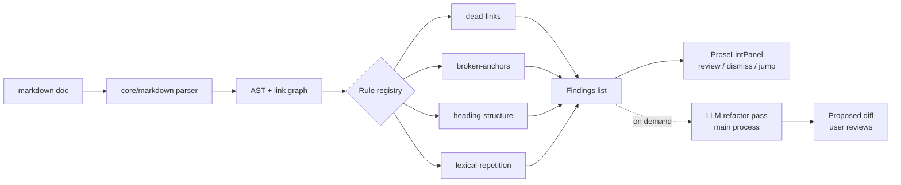

# Prose Lint & Refactor in Axonize

> The `/simplify` idea, applied to prose. Code accumulates entropy as blocks are appended; so do documents. A markdown "refactor" pass keeps a doc internally consistent, de-duplicated, and tonally coherent as it grows through incremental edits.

---

## The Problem: Documents Drift as They Grow

Source code has a well-understood failure mode: you append a feature, then a fix, then another section, and the overall structure degrades. Claude Code's `/simplify` exists to counter exactly this — after new blocks land, it runs a pass to fold the addition into the surrounding style, remove duplication, and keep complexity flat.

**Prose has the identical failure mode, with no equivalent tool.**

A real example from working on `focused-islands-vision.md`: the document grew vision → comparison diagrams → cross-links → a graph-store note. Each edit was reactive and locally correct, but the accumulated result drifted:

- The **deterministic-core** idea ended up restated in four different sections.
- The **Palantir comparison** lived in both the original prose framing *and* the later diagrams.
- **Glossary terms** were defined twice in different words.
- Heading numbering and an anchor link added mid-stream went stale.

None of these are spelling or grammar errors — every sentence is fine in isolation. The defect is **structural entropy**: redundancy, drift, and inconsistency introduced by incremental edits. That is precisely what a refactor pass addresses, and precisely what no current command does.

### Why existing ideas don't cover this

The [HTML & Interactive Islands](./html-and-interactive-islands.md) proposal includes "Enhanced AI editing" (Rewrite / Visualize / Enhance) and "Smart pull triggers." Those operate on a *selection or a moment* — rewrite this paragraph, suggest an improvement now. Prose lint is different in scope and intent:

- **Document-wide, not selection-scoped** — it reasons about the whole doc (or the whole vault) to find cross-section duplication.
- **Consistency-driven, not improvement-driven** — the goal is internal coherence and lower entropy, not "make this better."
- **Diagnostic-first** — like the existing semantic errors panel, it surfaces findings the user can accept or dismiss, rather than silently rewriting.

---

## Vision: Two Tiers — Deterministic Lints + LLM Refactor

The capability splits cleanly into a fast local tier and a slower LLM tier, mirroring the graph extraction passes (local AST first, Claude second).

### Tier 1 — Deterministic lints (local, no LLM)

Fast, cheap, runnable on every save. Rule-based checks over the parsed markdown AST. These map directly onto the "code lint" intuition — verifiable, explainable, zero token cost.

| Lint | What it checks |
|------|----------------|
| **Dead links** | Internal `[[wikilinks]]` and relative `[...](./x.md)` that point nowhere |
| **Broken anchors** | `#heading-anchor` links whose target heading no longer exists |
| **Heading structure** | Skipped levels (h2 → h4), stale manual numbering, duplicate headings |
| **Orphaned images** | Referenced images missing from disk, or image files referenced by nobody |
| **Stale cross-refs** | Links to vault files that were renamed or deleted |
| **Repetition (lexical)** | Near-identical sentences/paragraphs within a doc (shingling / hashing) |
| **Glossary collisions** | A term defined in two places with differing definitions |
| **Code-fence hygiene** | Unlabeled fences, fences whose language tag doesn't parse |

### Tier 2 — LLM refactor pass (Claude, on demand)

The semantic equivalent of `/simplify`. Invoked explicitly (it costs tokens and rewrites content), it reasons about *meaning*, not just structure:

1. **De-duplicate** — find the same idea stated in N sections; keep the canonical statement, replace the rest with a reference.
2. **Consolidate** — merge overlapping sections that grew independently (e.g. a comparison appearing in both prose and a diagram).
3. **Check structure** — propose heading reorganization, fix numbering, dedupe glossary entries.
4. **Tighten** — trim repetition and filler introduced by incremental edits, *without losing content* (this is the hard constraint — it must be lossless on facts, only lossy on words).
5. **Tone match** — bring a freshly appended block in line with the document's existing register, sentence length, and terminology.

The refactor pass **always produces a diff for review**, never an in-place silent rewrite. Lossless-on-facts is the invariant the user verifies.

---

## Architecture for Axonize

### Where it lives

```
src/core/prose/                 # pure, shared — parse + deterministic lints
  ├── lint-types.ts             # ProseLint const-object + type, Severity
  ├── rules/                    # one file per rule (OCP: data-driven registry)
  │   ├── dead-links.ts
  │   ├── broken-anchors.ts
  │   ├── heading-structure.ts
  │   ├── lexical-repetition.ts
  │   └── ...
  └── run-lints.ts              # registry dispatch over the markdown AST

src/main/prose/                 # main process — LLM refactor pass
  └── refactor-service.ts       # Claude-driven, emits a proposed diff

src/renderer/components/Sidebar/ProseLintPanel.tsx
                                # diagnostics list, same pattern as semantic errors
```

- **Deterministic lints** reuse the existing `core/markdown/` parser — they run in the renderer or main with no IPC round-trip and no model call.
- **Refactor** is a main-process service (LLM access lives there) invoked via `window.axonize.prose.refactor(filePath)`, returning a proposed edit the renderer renders as a reviewable diff.
- **Diagnostics surface** mirrors the existing semantic errors panel: a list of findings with severity, location (`file:line`), and a one-click jump / fix-or-dismiss action.

### Rule registry (data-driven, per CLAUDE.md)

Each lint is a small object implementing a shared `ProseLintRule` interface — `{ id, severity, run(ast, ctx): Finding[] }` — registered in a lookup map. New rules are added by dropping a file in `rules/` and registering it; no `if/else` chain, no catch-all `constants.ts`.



### Vault-wide vs. single-doc

- **Single-doc** (default, fast): all Tier-1 lints + optional Tier-2 refactor on the active document.
- **Vault-wide** (on demand): cross-document dead-link and glossary-collision detection over the whole knowledge base — this is where the [knowledge-graph](./knowledge-graph-for-kb-search.md) link index pays off, since the graph already knows what references what.

---

## How It Fits the Focused-Islands Vision

Prose lint is **not a new island type** — it's a cross-cutting quality layer that operates on the markdown substrate every island shares. It complements the existing vision rather than extending the island taxonomy:

| Concept | Prose Lint & Refactor |
|---------|------------------------|
| **Read mode** | Subtle inline markers for findings (like semantic errors), non-intrusive |
| **Focus mode** | Full lint panel + side-by-side refactor diff |
| **Agent suggestion** | "This doc has 4 duplicate statements of X — consolidate?" |
| **Local-first** | Tier 1 is 100% local; Tier 2 is opt-in Claude |

It also reinforces the cross-cutting themes both existing proposals share: **structure-aware AI**, **local-first**, **incremental**, and **explainable** (every finding points at a specific location and rule).

---

## Triggering

Borrowing the "smart pull triggers" idea from HTML islands, but tuned for entropy rather than improvement:

- **On save** — run Tier-1 lints, update the diagnostics count (cheap, always on).
- **On significant append** — when a doc grows by more than a threshold since the last refactor, surface a gentle "this doc has drifted — run a refactor pass?" nudge.
- **Explicit command** — a user-invokable action ("Refactor this document") that runs Tier 2 and shows the diff. This is the direct analog of `/simplify`.

---

## Open Questions

### Scope
1. **Lossless guarantee:** How do we verify the refactor pass didn't drop a fact, only words? (Diff review is the floor; can we do a semantic equivalence check?)
2. **Vault-wide cost:** Cross-doc lints over 10k files — incremental, cached on file hash like the graph pipeline?
3. **Rule severity:** Which lints are errors vs. warnings vs. hints? Who decides defaults?

### UX
1. **Noise:** How do we avoid the panel becoming a wall of pedantic findings users learn to ignore?
2. **Trust:** How prominent should the refactor nudge be without becoming nagging?
3. **Per-vault config:** Should rules be toggleable / configurable per vault (à la `.vale.ini`)?

### Technical
1. **Tier-1 vs Tier-2 boundary:** Some checks (glossary collisions) are detectable locally but resolvable only by LLM — how do the tiers hand off?
2. **Diff application:** Reuse the existing edit/IPC path, or a dedicated review surface?

---

## Prior Art

- **Vale** — config-driven prose linter (style rules, weasel words, passive voice) — model for the deterministic tier and per-vault config.
- **write-good / proselint** — rule-based readability lints.
- **Claude Code `/simplify`** — the originating analogy: refactor-after-append to hold quality flat as code grows.

The novel part for Axonize is **Tier 2** — an LLM refactor pass with a lossless-on-facts invariant, surfaced as a reviewable diff, integrated with the vault's link graph for cross-document consistency.

---

## Related Documents

- [Focused Islands Vision](../focused-islands-vision.md) — core island architecture
- [HTML & Interactive Islands](./html-and-interactive-islands.md) — enhanced AI editing, smart pull triggers
- [Knowledge Graph for KB Search](./knowledge-graph-for-kb-search.md) — the link index that powers vault-wide lints

---

**Status:** Implemented — Tier 1 (deterministic rules in `src/core/markdown/lint/`) and Tier 2 (`prose:refactor` + diff-review dialog). Vault-wide lints in progress.
**Last updated:** 2026-06-11
