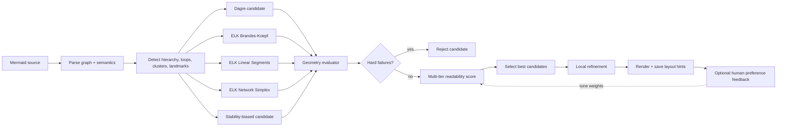

# Human-Friendly Mermaid Diagram Layout
## Research synthesis and implementation recommendations

**Date:** August 2026  
**Target:** Applications that render Mermaid diagrams and want layouts that feel closer to careful human drawings than to default automatic graph layouts.

---

## Executive recommendation

Do **not** try to replace Mermaid with one “better” layout algorithm.

A stronger architecture is:

1. **Generate several plausible layouts** using Dagre/ELK variants.
2. **Reject layouts with catastrophic readability defects** such as node overlap, edge-through-node routing, label occlusion, or severe flow reversals.
3. **Score the surviving layouts with multiple human-readability metrics**, with edge crossings and path continuity weighted much more strongly than cosmetic symmetry.
4. **Apply a small local refinement pass** to straighten important paths, align nearly aligned nodes, compact unnecessary whitespace, and isolate feedback edges.
5. **Preserve selected landmarks between edits**, rather than freezing the whole diagram.
6. Later, collect **pairwise human preferences** ("A or B is clearer?") and tune the metric weights for the kinds of diagrams your application actually draws.

In short:

> **Mermaid source → semantic analysis → candidate layouts → geometry scoring → local refinement → stable rendering**

This is closer to current graph-drawing research than attempting to find a universal scalar score or a single universally best engine.

---

## 1. What the graph-drawing literature actually says

### 1.1 Edge crossings are still the first thing to attack

Classic controlled experiments by Purchase and later studies consistently found that edge crossings have a large effect on graph comprehension. In the 1997 study *Which Aesthetic Has the Greatest Effect on Human Understanding?*, reducing crossings had a substantially stronger effect than minimizing bends or maximizing symmetry.

This does **not** imply that crossing count is the whole objective. It means crossings deserve a high-priority penalty.

For unavoidable crossings, later eye-tracking and cognitive studies show that **crossing angle matters**: near-right-angle crossings are easier to disambiguate than acute crossings.

**Recommendation**

Use a hierarchy such as:

1. eliminate node/label occlusion;
2. minimize crossings;
3. maximize the angle of unavoidable crossings;
4. only then optimize lower-priority aesthetics.

---

### 1.2 Path continuity is unusually important for flow diagrams

Ware, Purchase, Colpoys, and McGill found that **good continuation** strongly affects path-following tasks. Users can trace a route more easily when consecutive edges continue in roughly the same direction instead of repeatedly bending or making visually tempting branches.

This is especially important for Mermaid because many Mermaid diagrams are not generic social/network graphs. They are:

- workflows,
- architectures,
- dependency diagrams,
- state flows,
- business processes,
- pipelines.

For those diagrams, the ability to visually trace a **semantic path** is more important than globally beautiful geometry.

**Recommendation**

Add metrics that standard graph-drawing benchmarks often omit:

- primary-path bend count;
- primary-path angular deviation;
- number of direction reversals;
- percentage of forward semantic edges that travel in the chosen reading direction;
- misleading branch continuation.

---

### 1.3 One metric cannot represent a good drawing

Recent multi-objective work reinforces an old practical observation: optimizing one aesthetic can damage another.

For example:

- aggressively minimizing crossings may create extreme width or height;
- compacting the graph may reduce node separation;
- forcing source order can create additional crossings;
- uniform edge length may damage hierarchy;
- preserving exact previous positions can make an edited graph considerably uglier.

Sergey Pupyrev's 2026 experimental evaluation of planar graph drawing is especially relevant. No evaluated method dominated across all criteria, and score-guided combinations of methods produced stronger aggregate results. The paper also warns that an aggregate average can hide one conspicuously bad aesthetic.

**Recommendation**

Do not use:

```text
quality = 0.2*A + 0.2*B + 0.2*C + ...
```

as the only selection mechanism.

Prefer **guardrails + lexicographic priorities + weighted scoring inside each tier**.

---

### 1.4 Compactness needs a counterweight to clutter

A graph can get a good crossing score simply by spreading itself across a huge canvas.

The Sprawlter work explicitly addresses this problem: graph readability should account for both clutter and excessive spatial sprawl.

For an application UI this matters even more than in papers because users have:

- finite screen size;
- zoom thresholds;
- text that must remain legible;
- panels/toolbars around the diagram.

**Recommendation**

Measure both:

- local clearance / clutter;
- total bounding-box area or viewport utilization.

Do not simply minimize area. Penalize **unnecessary** area after sufficient clearance has been achieved.

---

### 1.5 Human drawings encode structure that geometry-only scores miss

Human-created drawings often expose a pattern—ladder, chain, repeated branch, symmetry, module, hierarchy—even when a purely geometric optimizer could shave a little off another metric.

HOLA (*Human-like Orthogonal Network Layout*) is an important example of an algorithm developed explicitly from human-layout observations and subsequent user evaluation.

The broader lesson is that a human-friendly engine should have some idea of **semantic structure**, not only `x/y` coordinates.

For Mermaid you have a major advantage over arbitrary graph drawing: the source already contains semantic signals:

- direction (`TB`, `LR`, etc.);
- subgraphs;
- node order;
- edge labels;
- repeated shapes;
- explicit IDs/classes;
- cycles and feedback edges;
- sources and sinks.

Use them.

---

### 1.6 Mental-map preservation is useful, but not as an absolute rule

Dynamic-graph research is nuanced. Preserving the mental map does not improve every task, but it can materially help orientation/navigation after a change.

Therefore, after a user modifies a Mermaid diagram, it is usually wrong to choose either extreme:

- **re-layout everything freely**, or
- **freeze every old coordinate**.

**Recommendation**

Use a **stability budget**:

- strongly stabilize landmarks, entry nodes, major modules, and the primary route;
- moderately stabilize ordinary unchanged nodes;
- freely move congested/problematic areas when a better layout requires it.

---

## 2. A metric stack for human-friendly Mermaid diagrams

The 2025 *Universal Quality Metrics for Graph Drawings* paper gives a useful standard vocabulary, including:

- angular resolution;
- aspect ratio;
- crossing angle;
- edge crossings;
- edge-length deviation;
- edge orthogonality;
- stress;
- neighbourhood preservation;
- node resolution;
- node uniformity.

However, those metrics are deliberately general and the authors note that directed graphs can require different principles.

For Mermaid, add a directed/semantic layer.

### Recommended priority tiers

| Tier | Metric / constraint | Suggested treatment | Why |
|---|---|---|---|
| **0 — hard failure** | Node-node overlap | reject | Never acceptable |
| | Edge through unrelated node | reject / enormous penalty | Creates semantic ambiguity |
| | Label overlap / clipping | reject / enormous penalty | Text is part of graph meaning |
| | Arrowhead hidden or ambiguous | reject | Direction becomes unclear |
| **1 — critical** | Edge crossings | very high penalty | Strong empirical readability effect |
| | Acute crossing angles | high penalty | Harder to visually separate paths |
| | Flow-direction reversal | high penalty | Damages directed-diagram scanning |
| | Important-path bends | high penalty | Damages path tracing |
| **2 — structural** | Path continuity | high reward | Human path-following |
| | Node resolution / clearance | medium-high | Avoids local clutter |
| | Edge-length deviation | medium | Avoids stretched/noisy drawings |
| | Back-edge intrusion | medium-high | Feedback edges should not cut through core flow |
| | Cluster leakage | medium-high | Preserve module boundaries |
| **3 — composition** | Sprawl / viewport usage | medium | Avoid giant sparse layouts |
| | Alignment | medium | Human drawings often exploit alignment |
| | Spacing consistency | medium | Improves perceived organization |
| | Aspect ratio | medium | Important for actual UI viewport |
| **4 — polish** | Symmetry | low-medium | Useful where structure is genuinely symmetric |
| | Orthogonality | low-medium | Helpful style, not a universal comprehension objective |
| | Grid snapping | low | Good final polish when it does not damage higher tiers |
| **5 — dynamic** | Landmark displacement | context-dependent | Supports mental map during edits |

---

## 3. Mermaid-specific metrics worth adding

These are likely more valuable for your application than adding another generic graph-aesthetic score.

### 3.1 Flow monotonicity

For a `TB` layout:

```text
forwardness(e) = max(0, y(target) - y(source))
```

Penalize ordinary forward-flow edges whose target is visually above the source.

For `LR`, apply the same idea on `x`.

A useful normalized metric is:

```text
flow_monotonicity =
    forward_edges_in_expected_direction / all_forward_edges
```

Do **not** apply this blindly to known loop/back edges.

---

### 3.2 Primary-path continuity

If an important route is:

```text
A → B → C → D
```

score:

- number of bends;
- angle change between consecutive segments;
- horizontal/vertical drift from a common axis;
- competing edges that visually continue more naturally than the intended next edge.

This directly models “Can my eye follow the process?”

---

### 3.3 Feedback-edge isolation

Detect cycle/back edges and prefer routing them:

- along one side of the diagram;
- around the outer boundary;
- with a visually recognizable return path.

Penalize a back edge that cuts through the center of the forward-flow hierarchy.

---

### 3.4 Branch fan-out quality

For a decision or high-degree node:

- distribute outgoing branches clearly;
- avoid two branches initially sharing almost the same route;
- prefer approximately regular spacing when semantics do not imply priority;
- give the main/likely route the straightest continuation if that information exists.

---

### 3.5 Join clarity

For merge nodes:

- preserve distinct incoming trajectories until close to the merge;
- avoid visually bundling unrelated inputs too early;
- provide enough arrowhead clearance.

This is one reason **edge merging should not automatically be treated as an aesthetic improvement**.

---

### 3.6 Label clearance

Measure minimum distance between every edge label and:

- unrelated edges;
- nodes;
- other labels;
- arrowheads.

Mermaid diagrams often carry a lot of semantics in labels, so this should be much more important than in unlabeled academic benchmark graphs.

---

### 3.7 Cluster integrity

For subgraphs/modules, penalize:

- an external edge traversing an unrelated cluster;
- excessive cluster boundary crossings;
- nodes belonging to one cluster being visually intermixed with another;
- huge unused cluster padding.

---

### 3.8 Landmark stability

After an edit:

```text
stability_cost =
    Σ importance(v) * distance(old_position(v), new_position(v))
```

Possible `importance(v)`:

- entry/root: 5
- major module/cluster anchor: 4
- node on selected/primary path: 4
- ordinary unchanged node: 1
- changed/new node: 0

Use this only after higher-priority readability failures are handled.

---

## 4. Recommended engine architecture



The key design decision is to make **layout generation and layout evaluation separate components**.

Then you can improve either independently.

---

## 5. Start by making Mermaid itself produce candidate layouts

Mermaid now exposes multiple layout choices, including Dagre and ELK, and provides a custom-layout extension mechanism.

For non-trivial flowcharts, generate several deterministic candidates instead of deciding that one ELK configuration is universally best.

### Candidate A — Dagre baseline

Dagre is still useful for simple DAGs and gives you a different error profile from ELK.

Never remove it merely because ELK is more configurable.

### Candidate B — ELK / Brandes-Koepf

Good general hierarchical baseline.

### Candidate C — ELK / Linear Segments

Worth testing when straight path continuation matters.

### Candidate D — ELK / Network Simplex

Useful as another node-placement candidate with different compactness/alignment trade-offs.

### Candidate E — model-order/stability biased

Use source/model ordering as a **soft semantic hint**, especially for incremental editing.

Do not force model order universally: preserving order can cost crossings.

---

## 6. Mermaid configuration recommendations

A reasonable current baseline is conceptually:

```yaml
---
config:
  layout: elk
  elk:
    mergeEdges: false
    nodePlacementStrategy: BRANDES_KOEPF
    considerModelOrder: NODES_AND_EDGES
    keepEntryNodeOnTop: true
---
```

Then create other candidates by changing `nodePlacementStrategy`.

### Keep `mergeEdges: false` by default

Bundling/merging can look cleaner while making it harder to know which source connects to which target.

Only enable it where your evaluator proves that the resulting drawing remains unambiguous.

### Treat source order as a hint, not a law

Source order can represent human intent, but blindly forcing it can cause avoidable crossings.

A useful approach is:

```text
score += order_preservation_bonus
```

rather than:

```text
layout MUST preserve source order
```

unless the user explicitly locked an order.

### Do not assume every ELK option is faithfully surfaced by Mermaid

As of 2026 there have been Mermaid issue reports around ELK spacing and cycle-breaking options not behaving exactly as expected through the wrapper.

For a product that wants strong layout control, Mermaid's **custom layout loader** or direct use of `elkjs` is the more robust long-term path.

---

## 7. Use Mermaid's custom-layout API instead of post-hacking SVG

Mermaid exposes a layout registration mechanism (`registerLayoutLoaders`) and a layout algorithm interface operating on layout data.

That is a much cleaner integration point than:

1. let Mermaid draw;
2. parse SVG;
3. move SVG elements afterward;
4. repair all the paths and labels.

A custom layout adapter can:

1. receive Mermaid's graph/layout data;
2. call your candidate generator;
3. calculate your human-readability score;
4. return the selected geometry;
5. use Mermaid's normal painting/rendering machinery.

This also makes it possible later to swap in:

- direct ELK;
- a constraint solver;
- your own incremental optimizer;
- a learned ranking model;

without changing Mermaid syntax.

---

## 8. Add a small local refinement stage

The 2026 Pupyrev work is interesting here: lightweight post-processing such as rotation and coordinate snapping can improve a drawing after the main layout method finishes.

For Mermaid, useful local moves are:

### Safe moves

- align nodes whose coordinates differ by only a few pixels;
- snap nearly equal rank coordinates together;
- straighten a high-value path;
- reduce an obviously oversized rank gap;
- move a leaf closer to its parent;
- order sibling nodes to remove one crossing;
- move feedback routes toward the periphery;
- compact disconnected components;
- align repeated structures.

### Avoid unconstrained “beautification”

Every local move must recompute at least:

- overlaps;
- crossings;
- labels;
- edge-node collisions;
- flow monotonicity.

A pretty alignment is not worth introducing one new critical crossing.

---

## 9. Use lexicographic scoring, not a single free-for-all weighted sum

A practical evaluator could look like this:

```ts
type LayoutScore = {
  hardFailures: number;

  critical: {
    crossings: number;
    acuteCrossings: number;
    flowReversals: number;
    primaryPathTurns: number;
  };

  structural: {
    pathContinuity: number;
    nodeClearance: number;
    clusterIntegrity: number;
    edgeLengthVariation: number;
  };

  composition: {
    sprawl: number;
    alignment: number;
    spacingVariation: number;
    aspectRatioPenalty: number;
  };

  dynamic: {
    landmarkMovement: number;
  };
};
```

Comparison:

```ts
function compare(a: LayoutScore, b: LayoutScore): number {
  // Tier 0
  if (a.hardFailures !== b.hardFailures) {
    return a.hardFailures - b.hardFailures;
  }

  // Tier 1
  const ac = criticalCost(a);
  const bc = criticalCost(b);
  if (Math.abs(ac - bc) > CRITICAL_EPSILON) {
    return ac - bc;
  }

  // Tier 2+
  return (
    structuralCost(a) + compositionCost(a) + dynamicCost(a)
    -
    structuralCost(b) - compositionCost(b) - dynamicCost(b)
  );
}
```

This prevents a ridiculous outcome such as:

> “Layout B has two extra crossings, but wins because its aspect ratio and symmetry scores are slightly better.”

---

## 10. Suggested initial heuristic weights

These are **starting values for experiments**, not research-derived universal constants.

| Feature | Initial penalty |
|---|---:|
| node-node overlap | reject |
| edge through node | reject |
| unreadable label overlap | reject |
| each edge crossing | 10 |
| crossing angle < 30° | +8 |
| crossing angle 30–60° | +4 |
| forward-flow reversal | 8 |
| bend on primary path | 5 |
| additional ordinary bend | 1 |
| back edge through central flow | 6 |
| cluster traversal | 6 |
| high edge-length deviation | 2 |
| poor node clearance | 3 |
| excess sprawl | 2 |
| spacing inconsistency | 1.5 |
| alignment loss | 1 |
| symmetry loss | 0.5 |
| landmark movement | 0–4 depending on editing context |

A better long-term method is to learn these from human comparisons.

---

## 11. Learn preferences from pairwise comparisons, not star ratings

Pupyrev's 2026 paper explicitly points toward human-labelled pairwise comparison as a useful next step.

This is a particularly good fit for your application.

Occasionally present:

```text
Which diagram is easier to understand?

[A]   [B]
```

Record:

- graph features;
- metric values for A and B;
- selected layout;
- diagram family;
- optionally user role/task.

Then fit a ranking model:

```text
P(A preferred to B)
    = f(metrics(A) - metrics(B))
```

You do not need an LLM for this. A logistic model or small gradient-boosted ranker may be enough and is much easier to interpret.

Later you can learn different profiles:

- architecture diagrams;
- workflows;
- ER-style relations;
- state machines;
- dependency graphs.

---

## 12. Consider semantics when selecting a "primary" route

One of the biggest opportunities unavailable to generic graph drawing is your knowledge of Mermaid's source.

Possible indicators of an important route:

1. entry/root to terminal/sink;
2. longest forward DAG path;
3. path containing selected/highlighted node;
4. route explicitly marked by a class;
5. route with higher-weight edges;
6. route inferred from interaction analytics.

Then optimize that route more strongly for:

- straightness;
- visibility;
- consistent direction;
- low crossings.

This produces a drawing that can be slightly less globally symmetric but substantially easier to read.

---

## 13. Incremental editing: stabilize selectively

When one or two Mermaid lines change, start from the previous layout.

### Keep stable

- unchanged root/entry;
- cluster positions where possible;
- selected node;
- major hubs;
- unaffected major path.

### Allow movement

- neighbors of inserted/deleted nodes;
- congested ranks;
- nodes involved in new crossings;
- clusters whose contents changed heavily.

ELK has interactive/semi-interactive concepts that are useful inspiration even if Mermaid's public wrapper does not expose everything you want.

A reasonable optimization objective is:

```text
new_layout_cost =
    readability_cost
  + λ * weighted_displacement_from_previous_layout
```

with `λ` lowered when the old arrangement causes serious readability defects.

---

## 14. Build your own evaluation corpus

Do not benchmark only on random graphs.

The 2025 GD collection is valuable as a research benchmark, but it largely represents the graph-drawing literature and is not specifically a corpus of directed Mermaid application diagrams.

Build a set of real Mermaid examples such as:

| Family | Examples |
|---|---|
| Simple flow | 5–20 nodes, mostly linear |
| Deep pipeline | many ranks, few branches |
| Broad decision tree | high fan-out |
| Workflow with loops | retries, error handling |
| Architecture | hubs + subgraphs |
| Crossing-heavy dependencies | unavoidable non-planarity |
| Nested subgraphs | module boundaries |
| Long-label diagrams | realistic application text |
| Repeated structures | parallel workers/services |
| Incremental edits | 1–5 nodes changed between versions |

Include small, medium, and large diagrams.

---

## 15. Evaluate with tasks, not only metric scores

The systematic-review literature on graph-layout evaluation shows that evaluation methods vary substantially, making raw paper-to-paper metric comparisons difficult.

For your product, measure actual user tasks.

### Task A — path tracing

> Starting at X, what node can be reached after condition Y?

Measure:

- correctness;
- completion time;
- wrong turns.

### Task B — impact analysis

> If service X fails, which downstream components are affected?

### Task C — structural comprehension

> Which module contains the retry loop?

### Task D — incremental orientation

Show version N, then version N+1.

> What changed?

### Task E — pairwise preference

> Which version is easier to understand?

The best algorithm is the one that improves these tasks, not necessarily the one with the highest generic aesthetic score.

---

## 16. Metrics to log in production

For every rendered candidate:

```text
graph_id
diagram_family
node_count
edge_count
cluster_count
cycle_count

layout_algorithm
layout_options
layout_runtime_ms

node_overlap_count
edge_node_collision_count
label_collision_count

edge_crossing_count
min_crossing_angle
p10_crossing_angle

primary_path_bends
flow_reversal_count
flow_monotonicity

node_resolution
edge_length_deviation
spacing_variance

bounding_width
bounding_height
viewport_fill_ratio
sprawl_score

landmark_displacement
total_displacement

chosen
human_preferred
```

This will quickly reveal which metrics correlate with actual preference for your diagrams.

---

## 17. Recommended implementation order

### Step 1 — geometry evaluator

Before writing a new layout algorithm, calculate:

- node/label overlap;
- edge-node intersections;
- crossings;
- crossing angles;
- bend counts;
- path continuity;
- flow reversals;
- clearance;
- bounding area.

This is the highest-leverage component because it can evaluate **any** current or future layout engine.

### Step 2 — candidate layout tournament

Run 3–6 configurations and pick the best according to the evaluator.

This can produce visible gains without inventing a graph layout algorithm.

### Step 3 — Mermaid-specific semantic metrics

Add:

- primary flow;
- feedback edges;
- cluster integrity;
- entry/sink anchoring.

### Step 4 — incremental stability

Feed previous coordinates into your scoring/optimizer and protect important landmarks.

### Step 5 — local refinement

Implement safe node swaps/nudges/alignment/compaction.

### Step 6 — pairwise preference learning

Learn weights from real use instead of endlessly hand-tuning them.

### Step 7 — only then consider a new solver

If candidate generation + refinement hits a ceiling, explore:

- direct ELK constraints;
- stress/multi-criteria optimization;
- constraint programming;
- differentiable optimization such as the ideas behind `(SGD)^2`;
- specialized orthogonal drawing.

---

## 18. What I would **not** do

### Do not train vision on rendered screenshots first

You already own exact geometry.

Computing crossings and occlusions from graph geometry is more direct, deterministic, explainable, and scalable than asking a vision model whether a screenshot “looks good.”

Use vision or multimodal models later for subjective style judgments only.

### Do not optimize just edge crossings

You will create sparse, stretched, or semantically awkward layouts.

### Do not make orthogonality mandatory

Orthogonal edges can look organized, but empirical work does not support treating 90-degree geometry as a universally dominant comprehension factor.

### Do not merge/bundle edges just because it looks clean

It can destroy source-target traceability.

### Do not force source order

Treat it as human intent evidence unless the author explicitly requests locked ordering.

### Do not preserve the whole mental map after every edit

Preserve important landmarks and let problematic regions move.

### Do not optimize for one universal graph family

A workflow and an architecture dependency graph want different trade-offs.

---

## 19. A practical "human-friendly" objective

If I had to define the product objective in one sentence:

> **A human-friendly Mermaid layout lets a user correctly follow the important semantic relationships with minimal visual search, while occupying a reasonable viewport and changing as little as necessary between edits.**

That is a better north star than “minimize crossings” or “make it symmetric.”

---

## 20. Research reading list, in recommended order

### 1. Purchase (1997), *Which Aesthetic Has the Greatest Effect on Human Understanding?*

Start here for the empirical hierarchy of classic aesthetics.

**Takeaway:** crossings matter strongly; not every traditional aesthetic produces an equivalent comprehension benefit.

DOI: `10.1007/3-540-63938-1_67`

---

### 2. Ware, Purchase, Colpoys & McGill (2002), *Cognitive Measurements of Graph Aesthetics*

Particularly useful for flow/path-centric Mermaid diagrams.

**Takeaway:** good continuation/path geometry matters alongside crossings.

DOI: `10.1057/palgrave.ivs.9500013`

---

### 3. Huang, Eades, Hong & Lin (2013), *Improving Multiple Aesthetics Produces Better Graph Drawings*

**Takeaway:** multi-aesthetic improvements can improve performance and reduce cognitive load.

DOI: `10.1016/j.jvlc.2011.12.002`

---

### 4. Huang, Eades & Hong (2014), *Larger Crossing Angles Make Graphs Easier to Read*

**Takeaway:** when a crossing cannot be removed, its geometry still matters.

DOI: `10.1016/j.jvlc.2014.03.001`

---

### 5. Liu et al. (2020), *The Sprawlter Graph Readability Metric*

**Takeaway:** balance clutter against excessive use of space.

DOI: `10.1109/TVCG.2020.2970523`

---

### 6. Kieffer, Dwyer, Marriott & Wybrow (2016), *HOLA: Human-like Orthogonal Network Layout*

**Takeaway:** derive aesthetics from human layouts, encode them algorithmically, then validate with people.

DOI: `10.1109/TVCG.2015.2467451`

---

### 7. Mooney et al. (2025), *Universal Quality Metrics for Graph Drawings: Which Graphs Excite Us Most?*

**Takeaway:** gives a modern standardized collection of ten geometric quality metrics and the `GD-collection-v1` benchmark.

DOI: `10.4230/LIPIcs.GD.2025.30`

---

### 8. Pupyrev (2026), *How to Draw a Planar Graph: An Experimental Evaluation*

**Takeaway:** no method wins every aesthetic; score-guided hybrid selection and lightweight post-processing are promising; avoid drawings that are conspicuously poor on any one criterion.

arXiv: `2607.23356`

---

### 9. Ahmed et al. (2022), *Multicriteria Scalable Graph Drawing via Stochastic Gradient Descent, (SGD)^2*

**Takeaway:** useful framework if you eventually want continuous multi-objective optimization rather than selecting among existing engines.

DOI: `10.1109/TVCG.2022.3155564`

---

### 10. Di Bartolomeo et al. (2024), *Evaluating Graph Layout Algorithms: A Systematic Review of Methods and Best Practices*

**Takeaway:** graph-layout evaluation is inconsistent across papers; build an application-specific evaluation suite and human-task benchmark.

DOI: `10.1111/cgf.15073`

---

### 11. Archambault & Purchase (2013), *The Mental Map and Memorability in Dynamic Graphs*

**Takeaway:** mental-map preservation is task dependent rather than universally beneficial.

DOI: `10.1016/j.ijhcs.2013.08.004`

---

## 21. Bottom line

For your Mermaid application, the most promising near-term approach is **not** a new graph-drawing algorithm.

Build a **human-readability controller around existing layout engines**:

```text
multiple layouts
      ↓
hard-constraint rejection
      ↓
human-oriented scoring
      ↓
semantic flow scoring
      ↓
small local refinements
      ↓
stability-aware selection
```

This gives you several advantages:

- immediate improvements using existing Mermaid/ELK/Dagre infrastructure;
- measurable quality instead of aesthetic guesswork;
- a clean path to incremental layout;
- a way to compare future algorithms objectively;
- data that can eventually train a preference ranker;
- an implementation that is specifically better for **directed, labelled, semantically structured Mermaid diagrams**, rather than generic academic graphs.

The first component I would build is therefore **the geometry/readability evaluator**, followed immediately by **candidate layout selection**.
