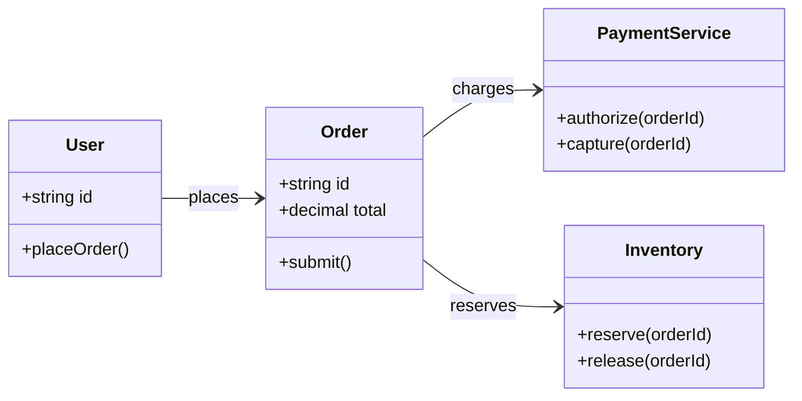
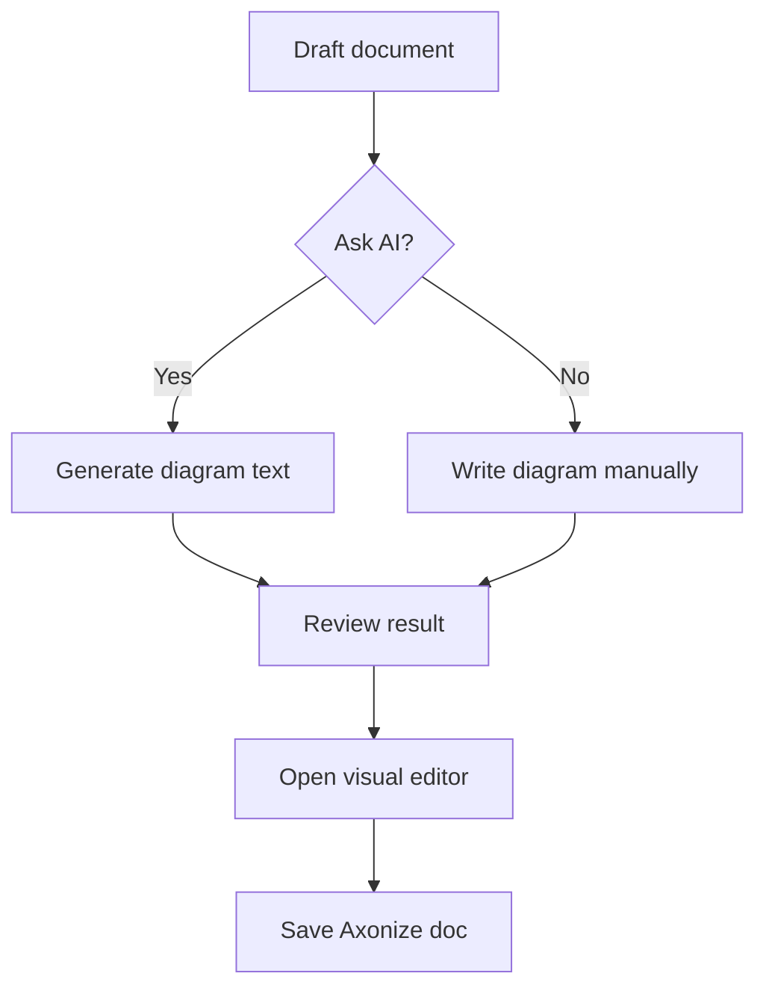
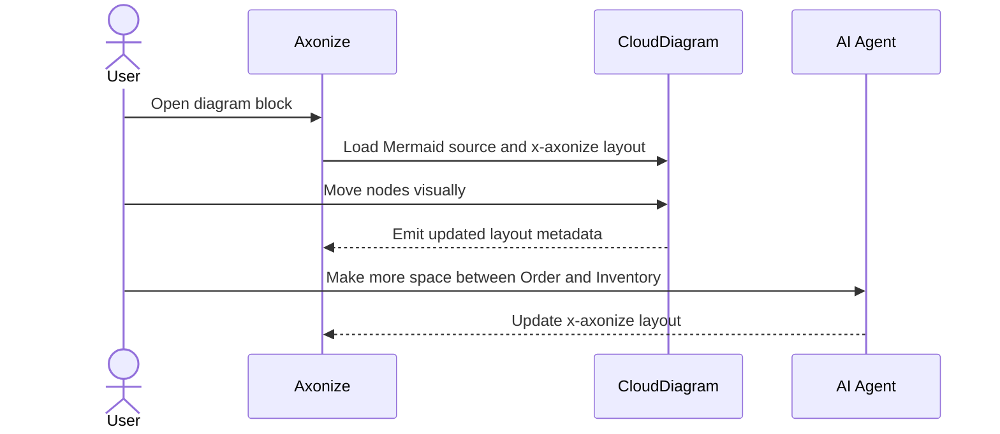
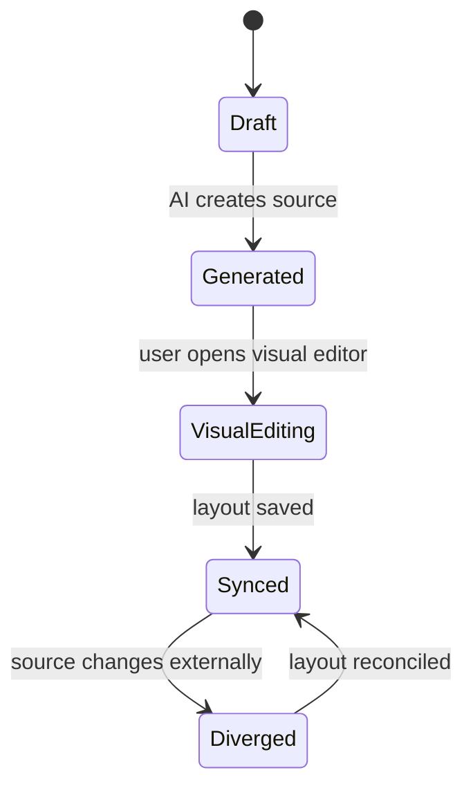
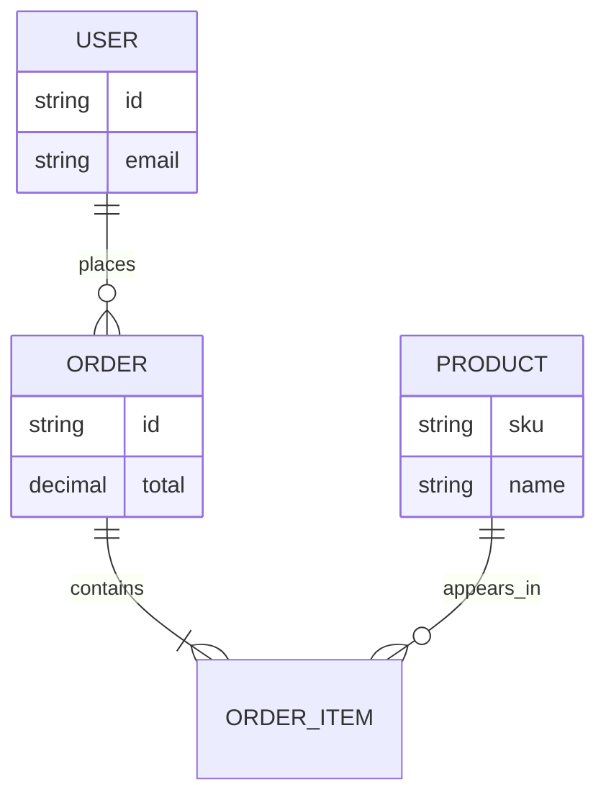
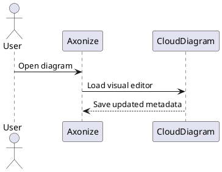
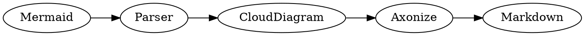

# Diagram Gallery

This document is a vault-level fixture for testing diagram rendering, AI edits, and the future CloudDiagram visual editor.

## Mermaid Class Diagram With Axonize Layout



## Mermaid Flowchart



## Mermaid Sequence Diagram



## Mermaid State Diagram



## Mermaid ER Diagram



## PlantUML Sequence Diagram



## Graphviz DOT



## D2

```d2
User -> Axonize: opens doc
Axonize -> CloudDiagram: visual edit
CloudDiagram -> Markdown: writes x-axonize metadata
```

## BPMN XML Sketch

```xml
<bpmn:definitions xmlns:bpmn="http://www.omg.org/spec/BPMN/20100524/MODEL">
  <bpmn:process id="diagramReview" name="Diagram Review">
    <bpmn:startEvent id="start" name="Draft created" />
    <bpmn:task id="edit" name="Edit diagram visually" />
    <bpmn:endEvent id="done" name="Saved" />
  </bpmn:process>
</bpmn:definitions>
```
