# Diagram Fixture Gallery

This fixture is a starter set for testing diagram rendering, AI edits, and future visual editing flows.

## Mermaid Class Diagram With Axonize Layout

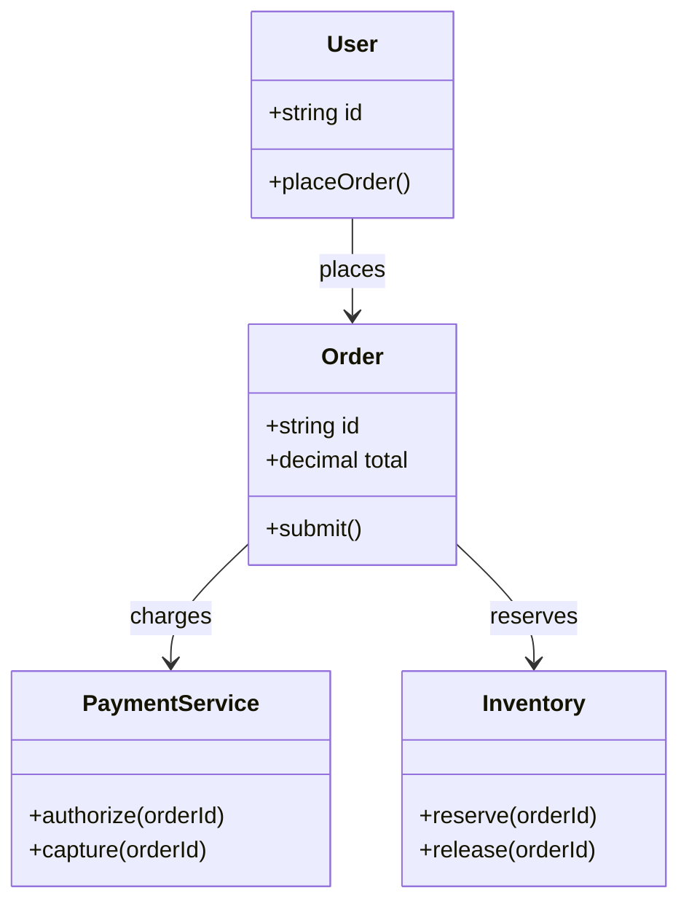

## Mermaid Flowchart

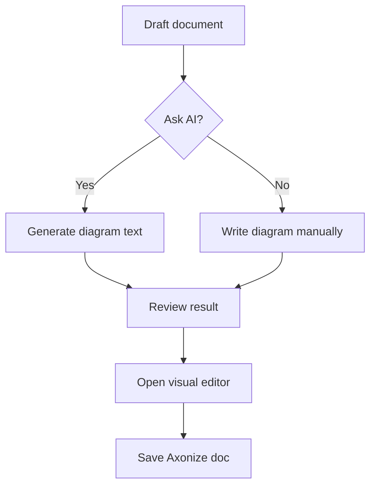

## Mermaid Sequence Diagram

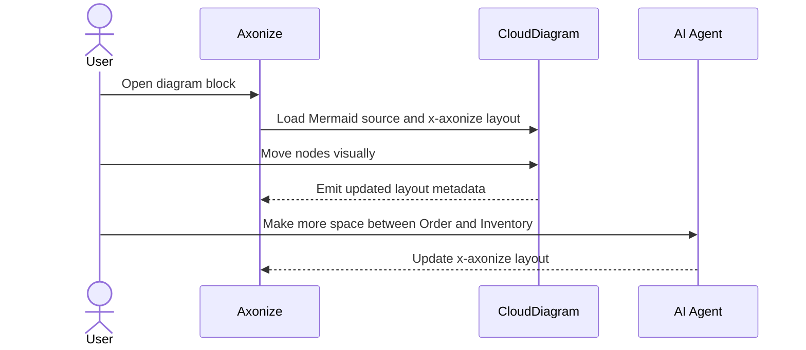

## Mermaid State Diagram

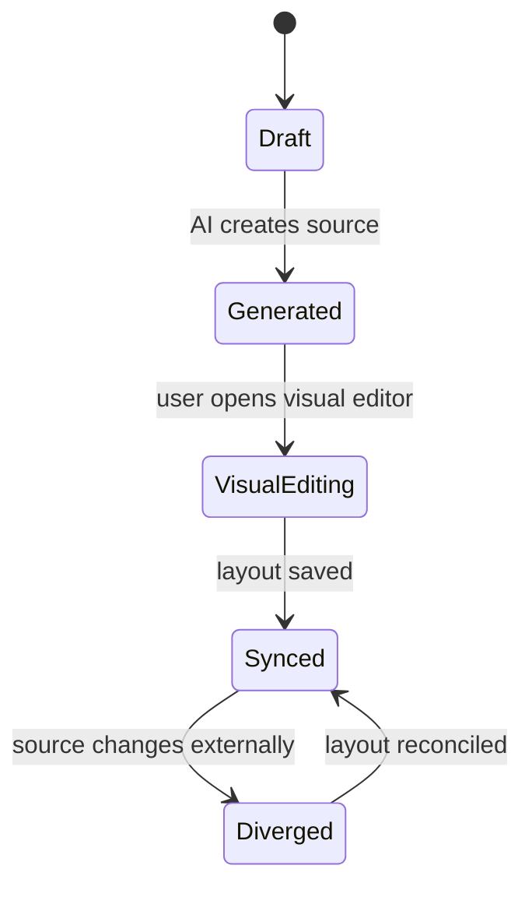

## Mermaid ER Diagram

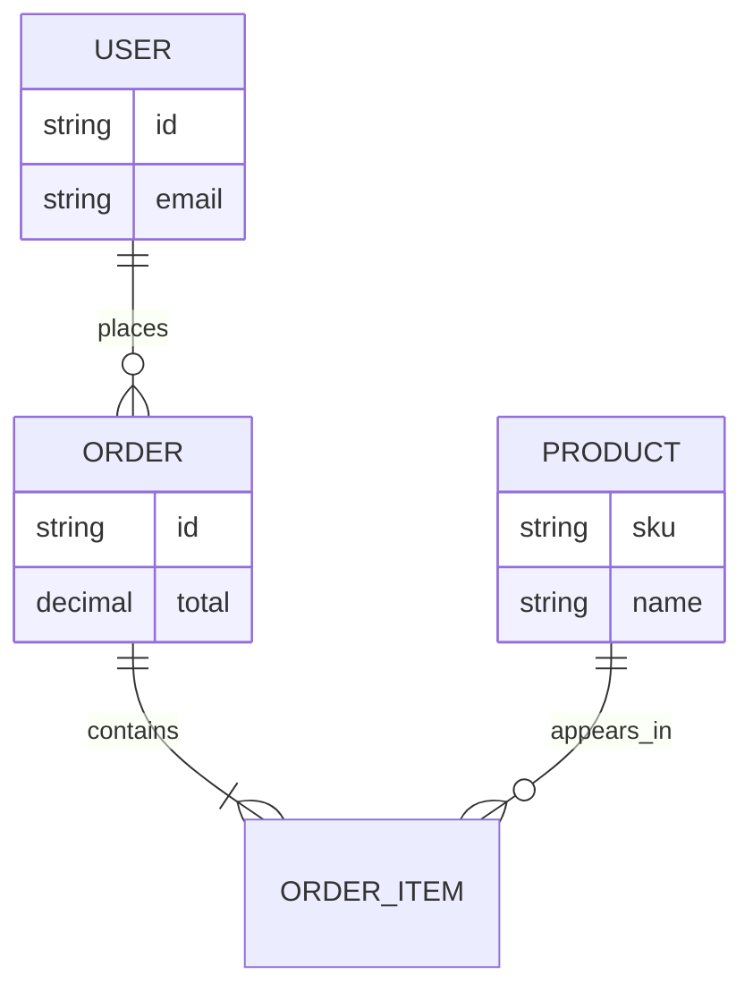

## Mermaid Gantt Chart

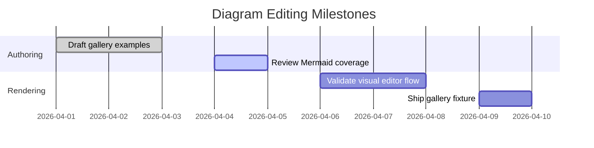

## Mermaid Pie Chart

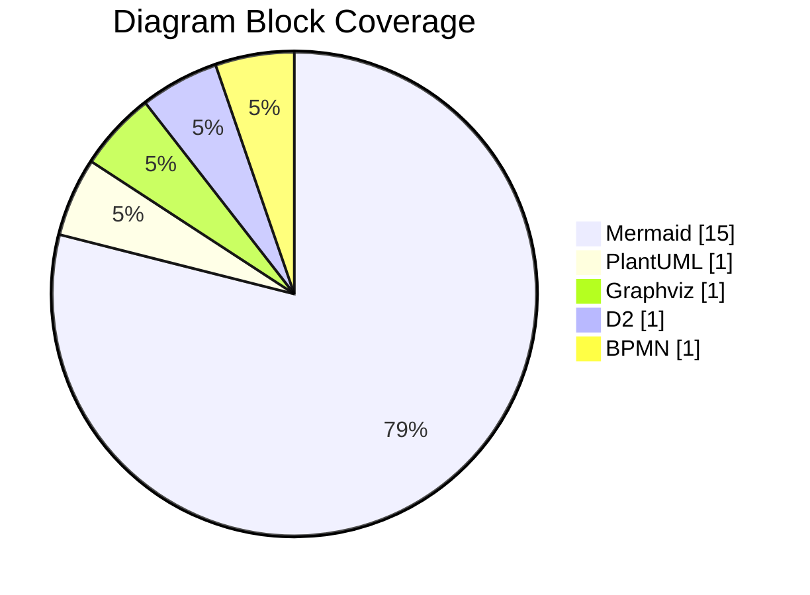

## Mermaid User Journey

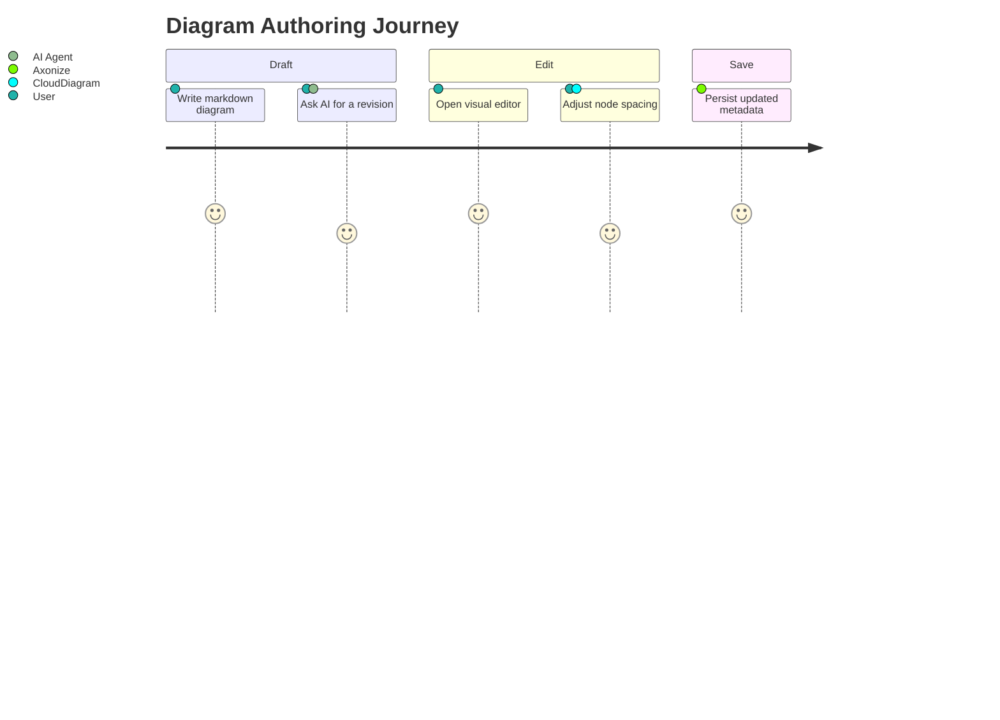

## Mermaid Git Graph

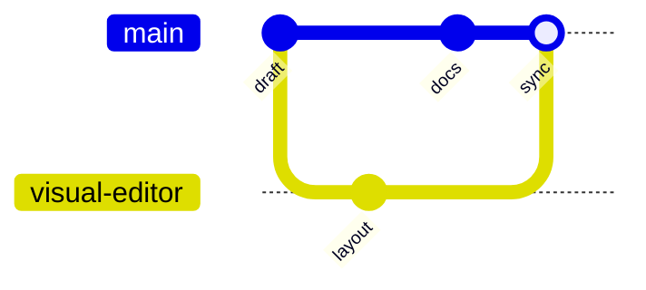

## Mermaid Mindmap

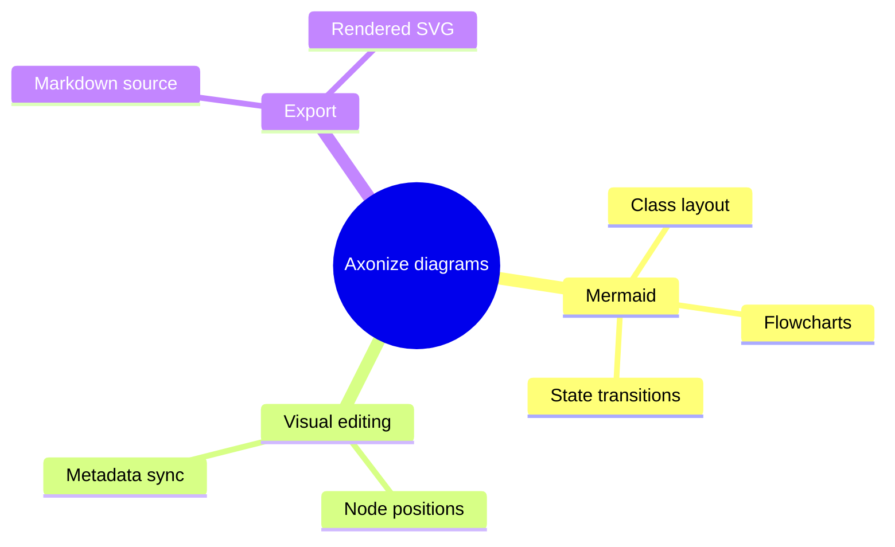

## Mermaid Timeline

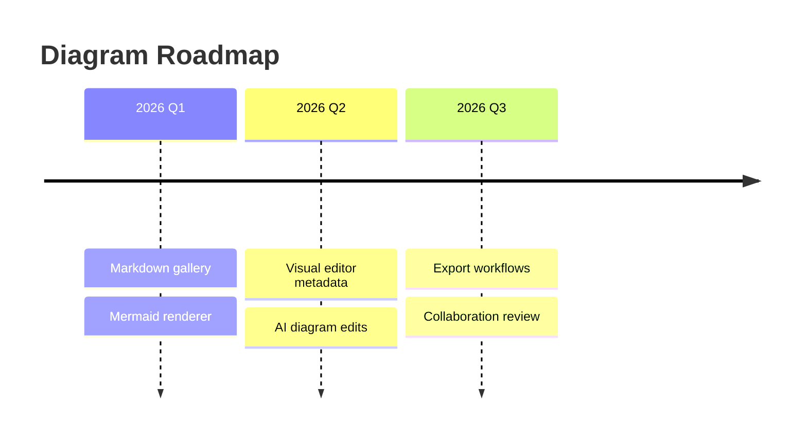

## Mermaid Quadrant Chart

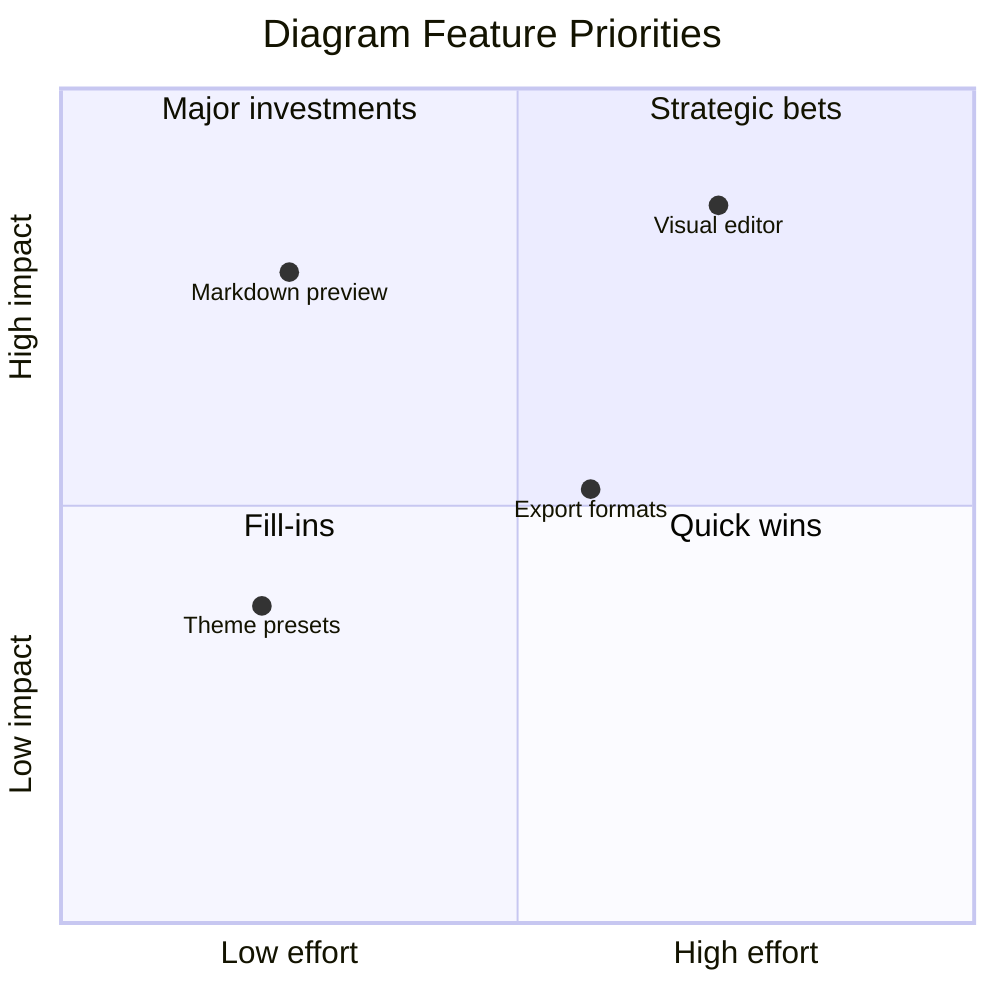

## Mermaid Requirement Diagram

```mermaid
requirementDiagram
    requirement render_gallery {
        id: RD-1
        text: Diagram gallery examples render in Axonize
        risk: medium
        verifymethod: test
    }

    element markdown_view {
        type: component
    }

    markdown_view - satisfies -> render_gallery
```

## Mermaid Block Diagram

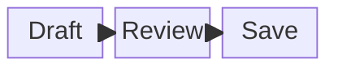

## Mermaid XY Chart

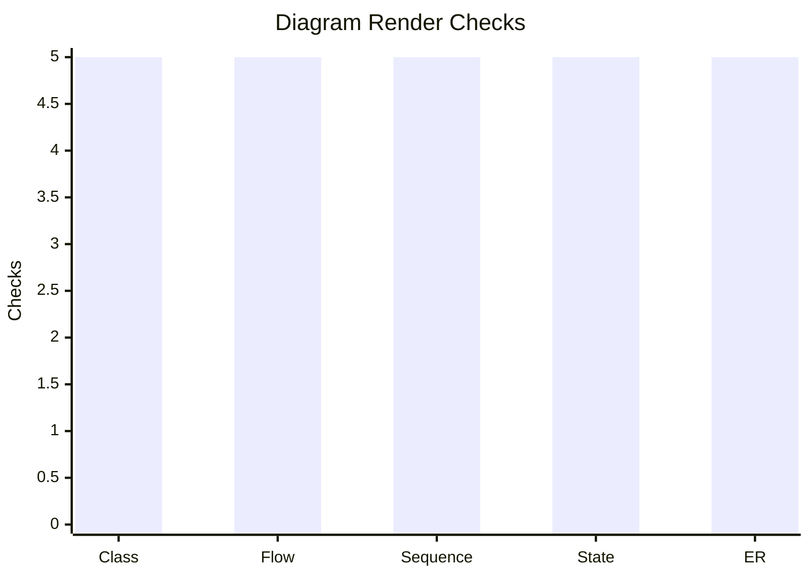

## PlantUML Sequence Diagram

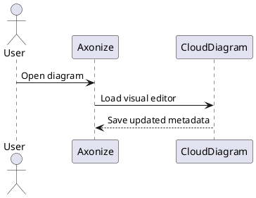

## Graphviz DOT

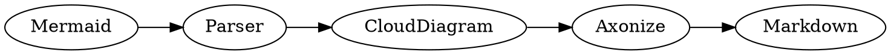

## D2

```d2
User -> Axonize: opens doc
Axonize -> CloudDiagram: visual edit
CloudDiagram -> Markdown: writes x-axonize metadata
```

## BPMN XML Sketch

```xml
<bpmn:definitions xmlns:bpmn="http://www.omg.org/spec/BPMN/20100524/MODEL">
  <bpmn:process id="diagramReview" name="Diagram Review">
    <bpmn:startEvent id="start" name="Draft created" />
    <bpmn:task id="edit" name="Edit diagram visually" />
    <bpmn:endEvent id="done" name="Saved" />
  </bpmn:process>
</bpmn:definitions>
```
